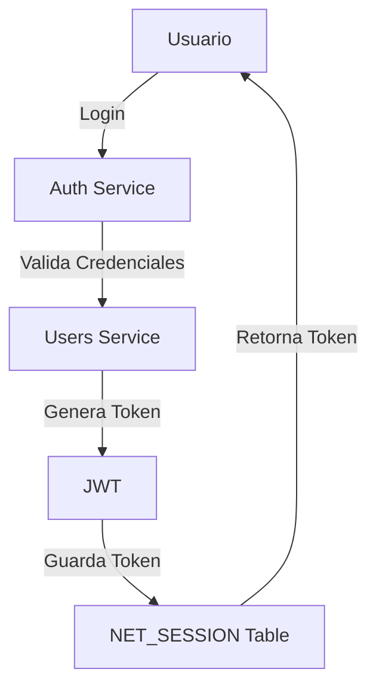
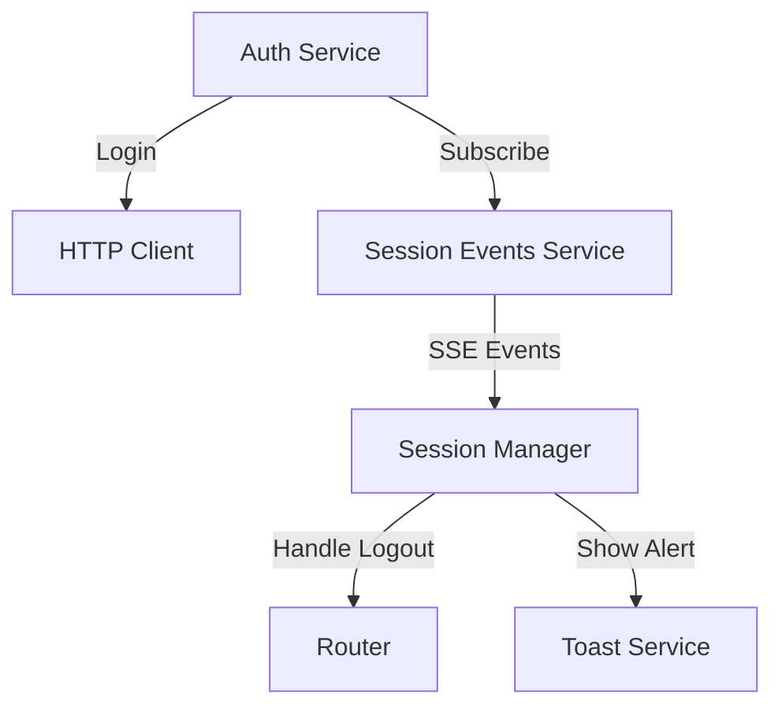
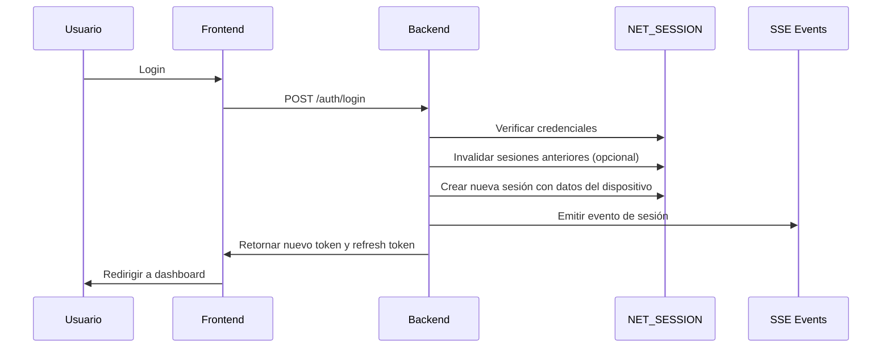
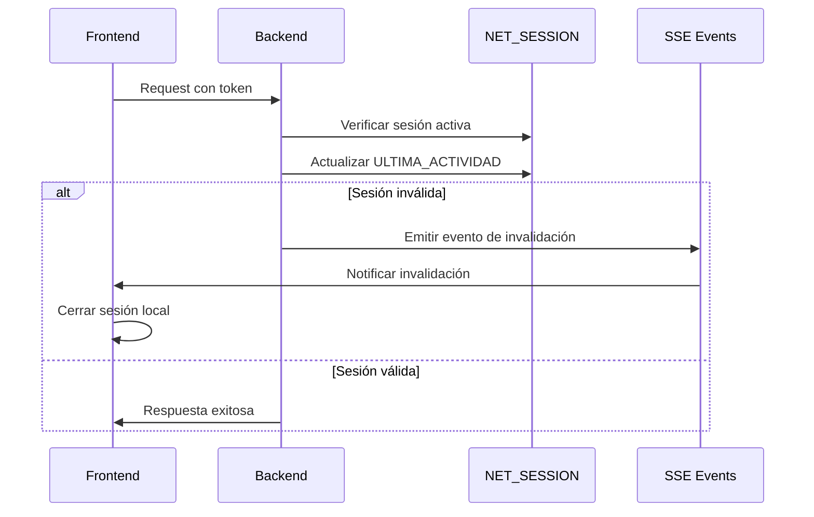
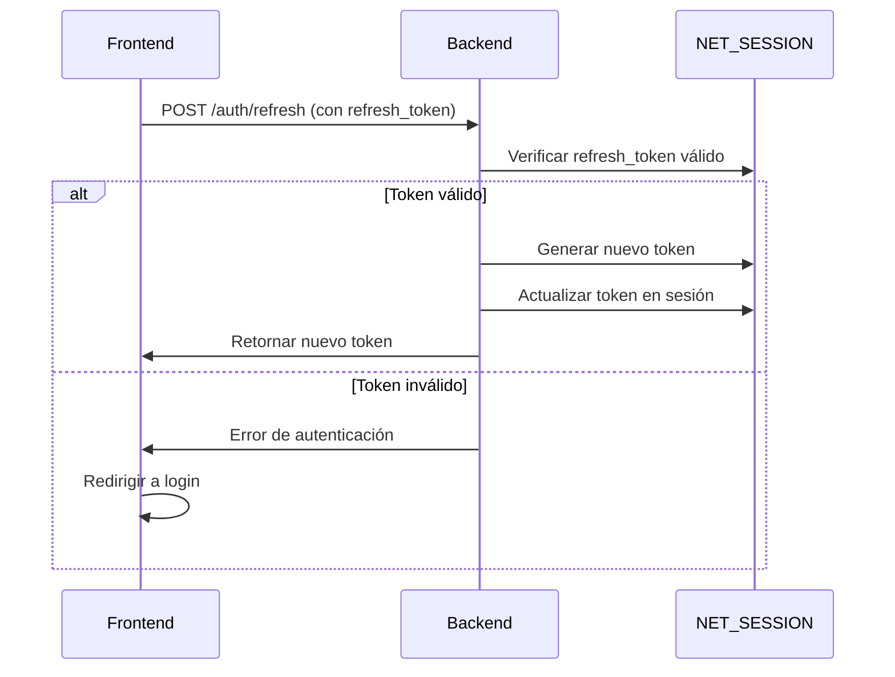

# Plan de Implementación de Single Sign-On (SSO) con Control de Sesión Única

## 1. Contexto Actual



### Componentes Existentes

- Tabla `NET_SESSION` para gestión de sesiones
- Manejo de tokens JWT
- Control de inactividad en frontend
- Manejo básico de sesiones por dispositivo

## 2. Cambios Propuestos

### 2.1 Backend (NestJS)

#### A. Base de Datos

```sql
-- Crear tabla NET_SESSION
CREATE TABLE NET_SESSION (
    ID_SESSION NUMBER GENERATED BY DEFAULT AS IDENTITY,
    TOKEN VARCHAR2(500) NOT NULL,
    REFRESH_TOKEN VARCHAR2(500),
    ID_USUARIO_EMPRESA NUMBER,
    USER_AGENT VARCHAR2(500),
    IP_ADDRESS VARCHAR2(50),
    FECHA_CREACION TIMESTAMP(6) DEFAULT CURRENT_TIMESTAMP NOT NULL,
    FECHA_EXPIRACION TIMESTAMP(6) NOT NULL,
    ULTIMA_ACTIVIDAD TIMESTAMP(6) DEFAULT CURRENT_TIMESTAMP,
    ESTADO VARCHAR2(20) DEFAULT 'ACTIVA' NOT NULL,
    CONSTRAINT PK_NET_SESSION PRIMARY KEY (ID_SESSION),
    CONSTRAINT FK_NET_SESSION_USUARIO_EMPRESA FOREIGN KEY (ID_USUARIO_EMPRESA)
        REFERENCES NET_USUARIO_EMPRESA (ID_USUARIO_EMPRESA) ON DELETE CASCADE,
    CONSTRAINT CHECK_NET_SESSION_ESTADO CHECK (ESTADO IN ('ACTIVA', 'EXPIRADA', 'REVOCADA', 'CERRADA'))
);

-- Índices para optimización
CREATE INDEX idx_net_session_token ON NET_SESSION(TOKEN);
CREATE INDEX idx_net_session_usuario ON NET_SESSION(ID_USUARIO_EMPRESA, ESTADO);
CREATE INDEX idx_net_session_refresh ON NET_SESSION(REFRESH_TOKEN);
```

#### B. Arquitectura de Servicios


1. **SessionService (Nuevo)**

   ```typescript
   @Injectable()
   export class SessionService {
     async createSession(userId: number, authData: AuthData): Promise<void> {
       // Invalidar sesiones anteriores (opcional según política)
       await this.invalidatePreviousSessions(userId)

       // Crear nueva sesión
       await this.sessionRepository.save({
         token: authData.token,
         refresh_token: authData.refreshToken,
         id_usuario_empresa: userId,
         user_agent: authData.userAgent,
         ip_address: authData.ipAddress,
         fecha_expiracion: addDays(new Date(), 1),
         estado: 'ACTIVA'
       })
     }

     async invalidatePreviousSessions(userId: number): Promise<void> {
       await this.sessionRepository.update(
         { id_usuario_empresa: userId, estado: 'ACTIVA' },
         { estado: 'REVOCADA' }
       )
     }

     async validateSession(token: string): Promise<boolean> {
       const session = await this.sessionRepository.findOne({
         where: { token, estado: 'ACTIVA' }
       })

       if (!session) return false

       if (session.fecha_expiracion < new Date()) {
         await this.updateSessionStatus(session.id_session, 'EXPIRADA')
         return false
       }

       // Actualizar última actividad
       await this.updateLastActivity(session.id_session)
       return true
     }

     async updateLastActivity(sessionId: number): Promise<void> {
       await this.sessionRepository.update(
         { id_session: sessionId },
         { ultima_actividad: new Date() }
       )
     }

     async refreshSession(refreshToken: string): Promise<string | null> {
       const session = await this.sessionRepository.findOne({
         where: { refresh_token: refreshToken, estado: 'ACTIVA' }
       })

       if (!session) return null

       // Generar nuevo token y actualizar
       const newToken = this.jwtService.sign({
         userId: session.id_usuario_empresa
       })
       await this.sessionRepository.update(
         { id_session: session.id_session },
         { token: newToken, ultima_actividad: new Date() }
       )

       return newToken
     }
   }
   ```

2. **SSE Controller (Nuevo)**

   ```typescript
   @Controller('api/sse')
   export class SSEController {
     @Get('session-events')
     @Sse()
     sessionEvents(): Observable<MessageEvent> {
       return interval(1000).pipe(
         map(() => ({ data: { type: 'session-check' } }))
       )
     }
   }
   ```

3. **Middleware de Sesión Activa (Actualizar)**
   - Verificar token activo en NET_SESSION
   - Actualizar fecha de expiración
   - Validar estado de la sesión

### 2.2 Frontend (Angular)



1. **SessionEventsService (Nuevo)**

```typescript
@Injectable({
  providedIn: 'root'
})
export class SessionEventsService {
  private eventSource: EventSource

  constructor() {
    this.eventSource = new EventSource('/api/sse/session-events')
    this.eventSource.onmessage = (event) => {
      // Manejar eventos de sesión
      const data = JSON.parse(event.data)
      if (data.type === 'session-invalidated') {
        this.handleSessionInvalidation()
      }
    }
  }

  private handleSessionInvalidation() {
    // Lógica de manejo de sesión invalidada
  }
}
```

2. **AuthInterceptor (Actualizar)**

   - Adjuntar token en headers
   - Manejar errores de sesión
   - Redireccionar en caso de sesión inválida

3. **UI Components**
   - Modal de sesión terminada
   - Indicador de sesión activa

## 3. Flujos de Trabajo

### 3.1 Inicio de Sesión



### 3.2 Validación Continua



### 3.3 Renovación de Token



## 4. Beneficios del Cambio

1. **Estructura Optimizada**

   - Modelo de datos más limpio y estandarizado
   - Mejor integración con el esquema existente
   - Índices optimizados para consultas frecuentes

2. **Mejor Control de Sesiones**

   - Estados de sesión claramente definidos
   - Manejo automático de expiración
   - Trazabilidad mejorada

3. **Seguridad Mejorada**
   - Validación robusta de sesiones
   - Control de sesiones concurrentes
   - Expiración automática

## 5. Plan de Implementación

1. **Fase 1: Base de Datos**

   - Crear tabla NET_SESSION con soporte para refresh tokens
   - Migrar datos existentes (si aplica)
   - Crear índices necesarios para búsquedas eficientes

2. **Fase 2: Backend**

   - Implementar SessionService
   - Actualizar UsuarioService
   - Configurar controladores SSE

3. **Fase 3: Frontend**

   - Implementar SessionEventsService
   - Actualizar AuthService
   - Crear componentes UI

4. **Fase 4: Pruebas**

   - Validar flujo de inicio de sesión
   - Probar manejo de sesiones múltiples
   - Verificar eventos SSE

5. **Fase 5: Despliegue**
   - Ejecutar scripts de base de datos
   - Desplegar cambios en backend
   - Actualizar frontend
   - Monitorear comportamiento
