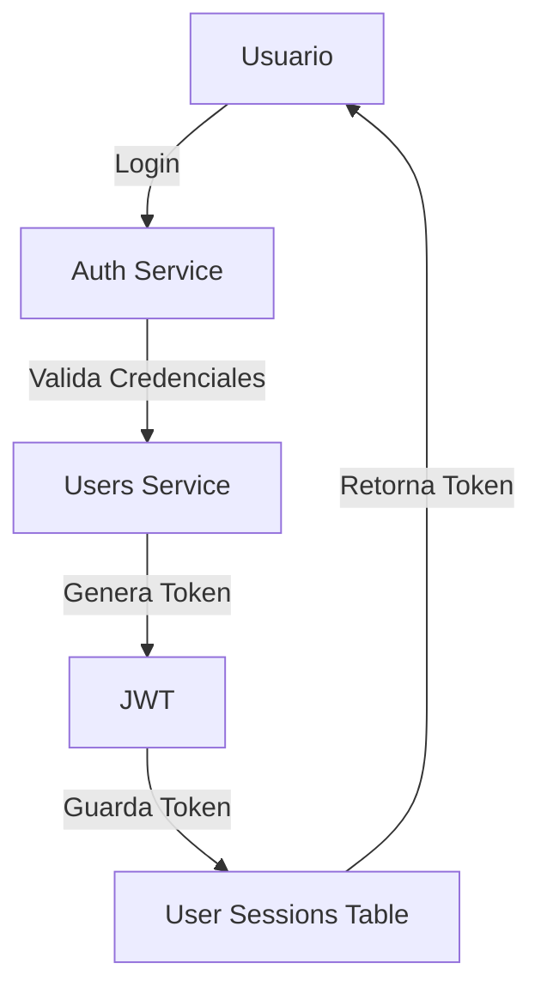
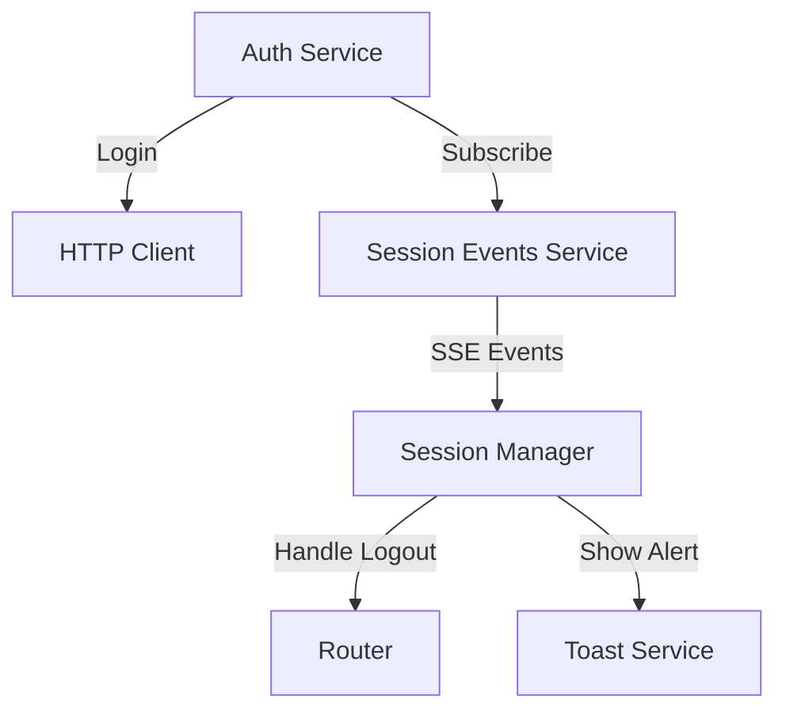
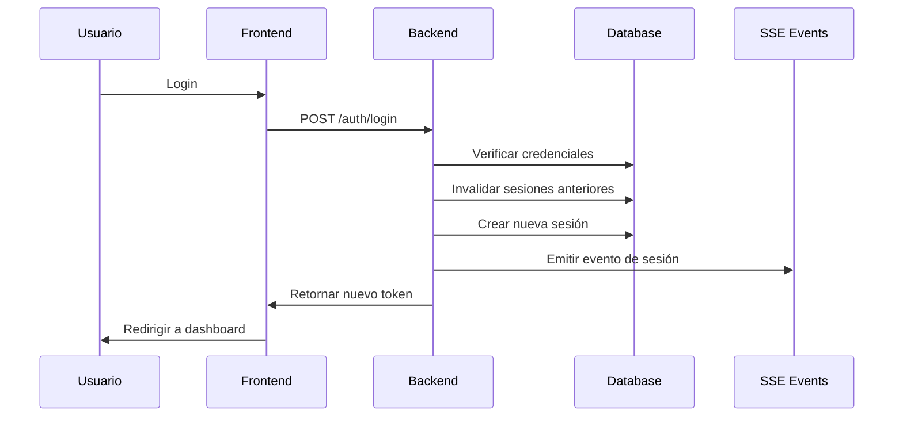
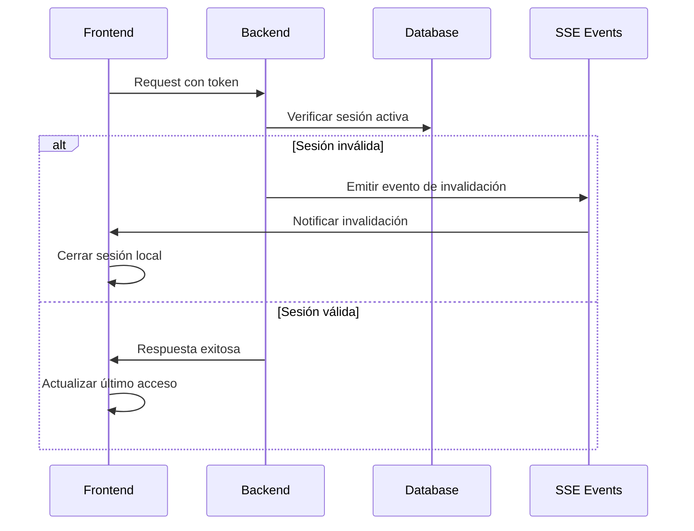

# Plan de Implementación de Single Sign-On (SSO) con Control de Sesión Única

## 1. Contexto Actual



### Componentes Existentes

- Tabla `user_sessions` con campos básicos
- Manejo de tokens JWT
- Control de inactividad en frontend
- Manejo básico de sesiones por dispositivo

## 2. Cambios Propuestos

### 2.1 Backend (NestJS)

#### A. Base de Datos

```sql
-- Modificar tabla user_sessions
ALTER TABLE user_sessions
ADD active BOOLEAN DEFAULT TRUE,
ADD lastActivity TIMESTAMP DEFAULT CURRENT_TIMESTAMP,
ADD deviceInfo VARCHAR2(500),
ADD ipAddress VARCHAR2(45);

-- Índices para optimización
CREATE INDEX idx_user_sessions_user_active ON user_sessions(user_id, active);
CREATE INDEX idx_user_sessions_token ON user_sessions(token);
```

#### B. Arquitectura de Servicios


1. **SessionService (Nuevo)**

   - Gestionar sesiones activas
   - Invalidar sesiones anteriores
   - Mantener registro de actividad

2. **SSE Controller (Nuevo)**

   ```typescript
   @Controller('api/sse')
   export class SSEController {
     @Get('session-events')
     @Sse()
     sessionEvents(): Observable<MessageEvent> {
       return interval(1000).pipe(
         map(() => ({ data: { type: 'session-check' } }))
       )
     }
   }
   ```

3. **Middleware de Sesión Activa (Actualizar)**
   - Verificar token activo
   - Actualizar última actividad
   - Validar límite de sesiones

### 2.2 Frontend (Angular)



1. **SessionEventsService (Nuevo)**

```typescript
@Injectable({
  providedIn: 'root'
})
export class SessionEventsService {
  private eventSource: EventSource

  constructor() {
    this.eventSource = new EventSource('/api/sse/session-events')
    this.eventSource.onmessage = (event) => {
      // Manejar eventos de sesión
    }
  }
}
```

2. **AuthInterceptor (Actualizar)**

   - Adjuntar headers de dispositivo
   - Manejar errores de sesión
   - Redireccionar en invalidación

3. **UI Components**
   - Modal de sesión terminada (informando que se cerró la sesión por inicio en otro dispositivo)
   - Indicador de sesión activa

## 3. Flujos de Trabajo

### 3.1 Inicio de Sesión



### 3.2 Validación Continua



## 4. Beneficios del Cambio a SSE

1. **Simplicidad**

   - Comunicación unidireccional del servidor al cliente
   - No requiere manejo de reconexiones como WebSocket
   - Mejor para eventos infrecuentes como invalidación de sesiones

2. **Eficiencia**

   - Menor overhead que WebSocket
   - Usa conexión HTTP estándar
   - Mejor manejo de firewalls y proxies

3. **Mantenibilidad**
   - Código más simple y directo
   - Menos estados que manejar
   - Integración más sencilla con Angular

## 5. Plan de Implementación

1. **Fase 1: Preparación**

   - Modificar tabla user_sessions
   - Implementar SessionService básico
   - Crear endpoints SSE

2. **Fase 2: Backend**

   - Implementar lógica de sesión única
   - Configurar emisión de eventos SSE
   - Actualizar middleware y guards

3. **Fase 3: Frontend**

   - Implementar SessionEventsService
   - Actualizar AuthService
   - Crear componentes UI

4. **Fase 4: Pruebas**

   - Validar manejo de sesiones múltiples
   - Probar escenarios de desconexión
   - Verificar notificaciones al usuario

5. **Fase 5: Despliegue**
   - Actualizar documentación
   - Desplegar cambios en base de datos
   - Monitorear comportamiento en producción
