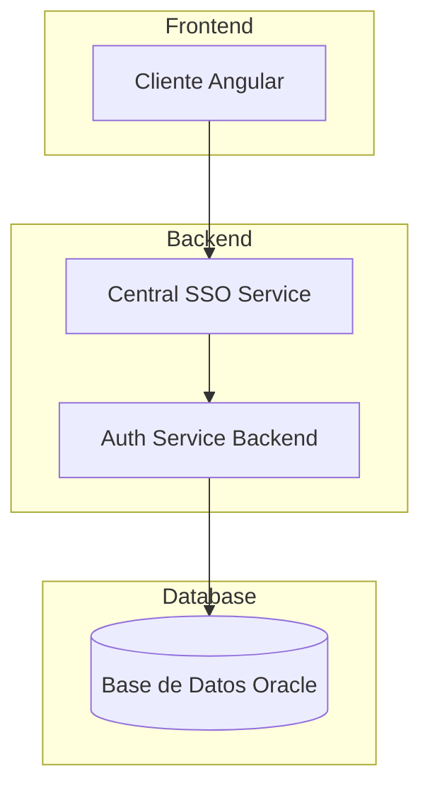
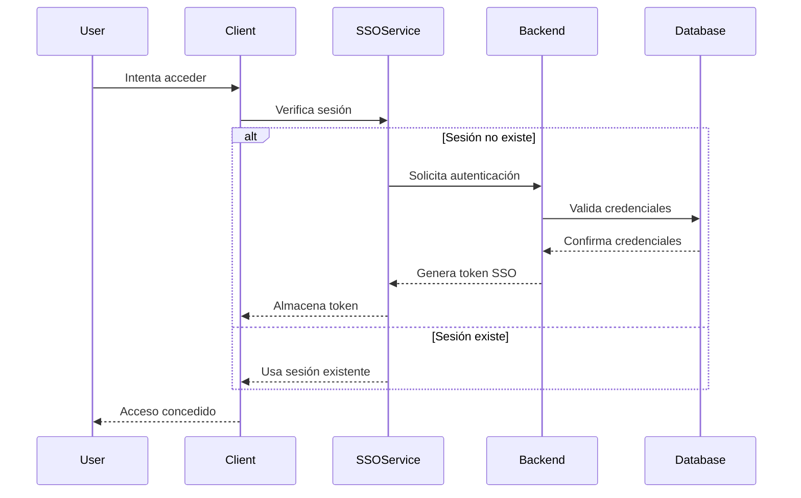
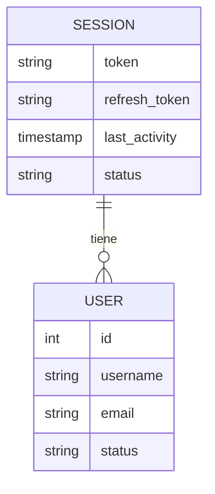

# Plan de Implementación de SSO Personalizado

## 1. Arquitectura General del SSO

## 2. Componentes Principales

### 2.1 Backend (NestJS)

1. **Servicio Central SSO**

   - Gestión de sesiones unificadas
   - Generación y validación de tokens
   - Control de acceso centralizado

2. **Base de Datos**
   - Almacenamiento de sesiones activas
   - Registro de intentos de autenticación
   - Tokens de acceso y refresco

### 2.2 Frontend (Angular)

1. **Servicio SSO**
   - Interceptor de autenticación
   - Manejo de tokens
   - Gestión de estado de sesión

## 3. Flujo de Trabajo

## 4. Plan de Implementación

### Fase 1: Configuración Inicial (2 días)

1. **Preparación de Base de Datos**

   - Crear tablas de sesión
   - Configurar índices y relaciones
   - Implementar procedimientos almacenados

2. **Configuración del Backend**
   - Implementar módulo de sesiones
   - Configurar middleware de autenticación
   - Establecer servicios base

### Fase 2: Implementación Backend (3 días)

1. **Desarrollo de Servicios SSO**

   - Implementar AuthService mejorado
   - Crear SessionService
   - Desarrollar TokenService

2. **Gestión de Sesiones**

   - Implementar manejo de sesiones concurrentes
   - Configurar tiempo de expiración
   - Desarrollar mecanismo de renovación

3. **Seguridad**
   - Implementar validación de tokens
   - Configurar CORS
   - Establecer rate limiting

### Fase 3: Implementación Frontend (3 días)

1. **Servicios de Autenticación**

   - Crear SSOService
   - Implementar SessionManager
   - Desarrollar TokenManager

2. **Interceptores y Guards**

   - Crear AuthInterceptor
   - Implementar SessionGuard
   - Configurar RoleGuard

3. **Componentes UI**
   - Desarrollar LoginComponent
   - Crear SessionInfoComponent
   - Implementar LogoutComponent

### Fase 4: Integración y Pruebas (2 días)

1. **Pruebas de Integración**

   - Validar flujo completo de autenticación
   - Probar manejo de sesiones
   - Verificar gestión de tokens

2. **Pruebas de Seguridad**
   - Realizar pruebas de penetración básicas
   - Validar protección CSRF
   - Verificar sanitización de datos

## 5. Estructura de Datos

## 6. Medidas de Seguridad

- Tokens JWT con tiempo de expiración configurable
- Sistema de renovación automática de sesiones
- Validación de origen de solicitudes (CORS)
- Cifrado de datos sensibles en tránsito y reposo
- Protección contra ataques CSRF
- Rate limiting para prevenir ataques de fuerza bruta
- Registro de actividad de sesiones
- Cierre automático de sesiones inactivas

## 7. Mejoras Futuras

- Implementación de autenticación de dos factores (2FA)
- Soporte para múltiples proveedores de identidad
- Sistema de notificación de sesiones sospechosas
- Panel de administración de sesiones
- Integración con sistemas de monitoreo

## 8. Consideraciones Técnicas

- Uso de Redis para caché de sesiones (opcional)
- Implementación de websockets para notificaciones en tiempo real
- Estrategia de manejo de errores consistente
- Sistema de logging centralizado
- Monitoreo de rendimiento

## 9. Timeline Detallado

1. **Fase 1: Configuración Inicial** (2 días)

   - Día 1: Configuración de base de datos
   - Día 2: Configuración inicial de servicios

2. **Fase 2: Implementación Backend** (3 días)

   - Día 3: Desarrollo de servicios core
   - Día 4: Implementación de gestión de sesiones
   - Día 5: Configuración de seguridad

3. **Fase 3: Implementación Frontend** (3 días)

   - Día 6: Desarrollo de servicios
   - Día 7: Implementación de interceptores
   - Día 8: Desarrollo de UI

4. **Fase 4: Integración y Pruebas** (2 días)
   - Día 9: Pruebas de integración
   - Día 10: Pruebas de seguridad y ajustes finales
